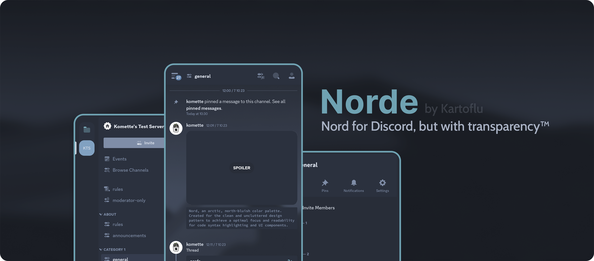
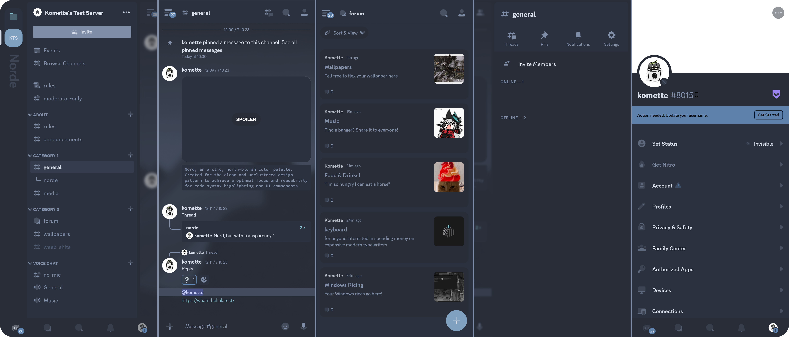

#### Note: This is the Vendetta version of Norde. For Aliucord, check [this](https://github.com/kartoflu/norde)

## Requirements
- Change Discord theme to Dark mode (Legacy) (if not set already)
  - If the app crashes when you enter Appearance, you'll have to enable tabV2 first. Refers to [tabV2]() for the full guide on how to enable this experimental feature.

## What's new?

### Norde for Vendetta now available!
- This is the first release of Norde for this Discord client, so if you have any issue, feel free to ask me (discord info here)
> You can check the full changelog [here](CHANGELOG.md)

## Plugin Configuration
These below are the recommended plugins for the best Norde experience. You can skip this part if you want, but I recommend giving it a try.
- [HideGiftButton](https://discord.com/channels/1015931589865246730/1093572761819025489/1093572761819025489) by pylix
- [CharCounter](https://discord.com/channels/1015931589865246730/1125333324232142898/1125333324232142898) by nexpid
- [Custom Timestamps](https://discord.com/channels/1015931589865246730/1130989920190738573/1130989920190738573) by Fiery

### Bonus: tabV2
This is an experimental redesign Discord has been working on recently and can only be enabled temporarily through the "sparkles" easter egg. However, there is a workaround for it using a module which let you access exclusive Staff only features, including enabling tabV2 permanently.
- First, you'll need [Experiments](https://discord.com/channels/1015931589865246730/1092595673217642516/1092595673217642516) module installed (please do disable update of this module (Settings > Plugins > 3-dot menu under Experiments > Disable updates) if you encounter any crashes)
- Now, go to Settings, scroll down until you see the Tabs UI Experiment settings and enable it.

Discord should restart afterward and you will be greeted by the brand new, redesigned UI. Note that this feature is still in development and thus can be very unstable.

## Previews

